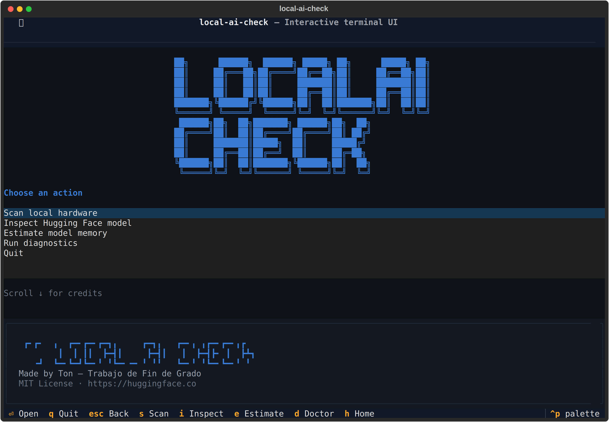
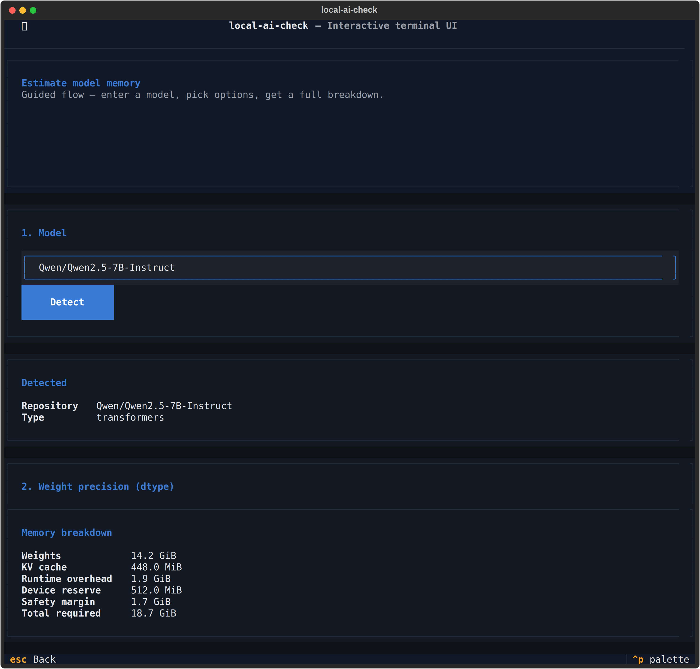

# local-ai-check

`local-ai-check` is an explainable local-AI capacity analyzer for inspecting Hugging Face models and estimating their hardware requirements. It reads your machine, reads a model's public metadata, and tells you whether the two fit — showing its work for every number.

The project is also being developed as part of an end-of-degree project (TFG) focused on corporate local-AI infrastructure. The tool intentionally stops short of downloading weights or running inference; every number it produces is derived from public metadata and documented heuristics.

## Interactive interface





## Requirements

- Python 3.12 or newer
- [uv](https://docs.astral.sh/uv/) for dependency and environment management

Optional:

- An NVIDIA driver + NVML for GPU/VRAM detection (falls back cleanly if absent)
- `HF_TOKEN` in the environment for gated or private repositories

## Install

### Use it from the repository

```bash
git clone https://github.com/Ton-Llop/AI-checker.git
cd AI-checker
uv sync
uv run local-ai-check ui
```

`uv sync` creates a virtual environment and installs the runtime dependencies plus the `dev` dependency group declared under `[dependency-groups]` in `pyproject.toml` — uv installs default groups automatically, so contributors need no extra flag. Pass `--no-dev` if you only want the runtime dependencies.

### Development

```bash
uv sync
uv run ruff check .
uv run mypy src
uv run pytest
uv build
```

## Commands

Five subcommands: `scan`, `inspect`, `estimate`, `doctor` (all classic CLI) and `ui` (interactive TUI). All read-only.

```bash
uv run local-ai-check ui                          # interactive terminal UI
uv run local-ai-check scan                        # local hardware
uv run local-ai-check doctor                      # environment health
uv run local-ai-check inspect <repo-id-or-url>    # analyze a model repository
uv run local-ai-check estimate <repo-id-or-url>   # memory footprint + compatibility
```

The two front-ends share the same services and produce the same numbers:

- **CLI** — for automation, scripting and reproducible output. `--json` emits a stable schema you can pipe into other tools.
- **TUI** — a guided, visual flow for exploring models interactively. Every action shows the equivalent CLI command so you can lift it into a script.

### `scan` — local hardware

```bash
uv run local-ai-check scan
```

Reports OS, architecture, CPU model + cores, RAM totals, storage per mount point and any NVIDIA GPU with VRAM/CUDA driver version.

### `inspect` — a Hugging Face model

```bash
uv run local-ai-check inspect Qwen/Qwen2.5-7B-Instruct
uv run local-ai-check inspect https://huggingface.co/Qwen/Qwen2.5-7B-Instruct/tree/main
```

All URL variants (repo root, `/tree/…`, `/blob/…`, `/resolve/…`) normalise to the same `repo_id`. The command queries `HfApi.model_info(files_metadata=True)`, classifies the repository (`transformers` / `gguf` / `diffusers` / `onnx` / `adapter` / `unknown`), downloads only tiny metadata files (`config.json`, index JSONs, `adapter_config.json`, `model_index.json`) when useful and prints a Rich table.

For GGUF repos it also reports each quantization variant separately and the largest single variant, so `Repository size` (sum of all files) is not confused with `Largest variant` or with the runtime memory of one specific quantization.

### `estimate` — memory footprint + compatibility

```bash
uv run local-ai-check estimate bartowski/Meta-Llama-3.1-8B-Instruct-GGUF \
    --quantization Q4_K_M --context 8192

uv run local-ai-check estimate Qwen/Qwen2.5-7B-Instruct --dtype int8 --context 4096
uv run local-ai-check estimate Qwen/Qwen2.5-7B-Instruct --dtype float16 --context 32768 --json
```

Produces an explainable breakdown:

```
Memory breakdown
Component         Size        Source     Explanation
Weights           4.92 GiB    exact      Exact remote file size of the Q4_K_M variant.
KV cache          1.00 GiB    derived    28 layers x 4 KV heads x 128 head_dim x 8192 tokens x batch 1 x 2 bytes x 2.
Runtime overhead  0.98 GiB    assumed    Base 0.50 GiB + 10% of weights (0.49 GiB).
Device reserve    0.50 GiB    assumed    Configured device reserve of 0.50 GiB.
Safety margin    0.74 GiB    assumed    10% of estimated subtotal.
Total required    8.14 GiB
```

Each row carries the *source* of the number (`exact`, `metadata`, `derived`, `assumed`, `unknown`) and the assessment carries a *confidence* (`high`, `medium`, `low`, `unknown`) reduced by the weakest link in the chain.

Options:

| Option | Default | Purpose |
|---|---|---|
| `--quantization` / `-q` | auto | GGUF variant to use (case-insensitive) |
| `--dtype` / `-d` | from config | Weight precision for transformers repos |
| `--context` / `-c` | `max_position_embeddings` or 4096 | Context length in tokens |
| `--batch-size` / `-b` | 1 | Sequences in parallel |
| `--device` | `auto` | `auto` / `gpu` / `cpu` |
| `--kv-dtype` | `float16` | KV cache element precision |
| `--safety-margin-percent` | 10 | Extra on top of subtotal |
| `--device-reserve-gib` | 0.5 | Memory to leave free on the target device |
| `--json` | off | Emit stable JSON to stdout (schema_version = 1) |
| `--no-resolve-base-model` | off | Skip base-model resolution and GGUF-header enrichment |
| `--no-runtime-recommendation` | off | Skip the runtime recommendation section |

### `doctor` — environment health

```bash
uv run local-ai-check doctor
```

### `ui` — interactive terminal UI (Textual)

```bash
uv run local-ai-check ui
```

Launches a full-screen Textual application. Five screens: **Home**, **Scan**, **Inspect**, **Estimate** (guided flow), **Doctor**. Same services, same numbers as the classic CLI — the TUI is a thin renderer over `detect_hardware`, `inspect_model`, `estimate_memory` and `collect_diagnostics`. Every action in Estimate shows the equivalent CLI command so you can capture it for scripts. Global bindings: `h` home, `s` scan, `i` inspect, `e` estimate, `d` doctor, `esc` back, `q` quit. Scroll down on the Home screen to see the app banner and credits.

The CLI classic subcommands remain the default; running `local-ai-check` with no arguments still shows help.

## Runtime recommendation

After computing the memory estimate, the tool suggests a concrete runtime and starter command:

| Repository type | Primary runtime | Alternative |
|---|---|---|
| GGUF | `llama.cpp` (llama-server / llama-cli) | — |
| Transformers | `transformers` (Python snippet) | `vllm` when the architecture is on the shortlist and the model fits fully in VRAM |
| Others (diffusers / onnx / adapter / unknown) | — | — |

Every recommendation carries per-flag provenance:

- `--n-gpu-layers` for llama.cpp is computed as `min(block_count, (available_vram − device_reserve − 256 MiB − kv_cache) / (weights / block_count))`. When `block_count` is unknown it falls back to a documented conservative default (20 layers) with a warning.
- `device_map` for Transformers is `"cuda"` when the model fits VRAM, `"auto"` for offloading (with an `accelerate` warning) and `"cpu"` otherwise.
- vLLM is only suggested when the architecture is in the shortlist (`llama`, `qwen2`, `mistral`, `phi3`, `gemma`, `gemma2`, `gemma3`) and the model fits GPU memory.
- If the memory assessment is `insufficient` no runtime is recommended — the user is told explicitly.

The commands are **generated**, not executed. Copy them into your terminal after downloading the actual weights (`huggingface-cli download <repo>`).

## Base model resolution and GGUF metadata enrichment

GGUF repositories typically ship only the quantized weights — no `config.json`, no way to compute KV cache from metadata alone. The estimator solves this in three layered steps, all with per-source provenance:

1. **Base-model resolution.** Priority order:
   1. `card_data["base_model"]` in the GGUF repo's model card (string, list of 1, or dict with `finetune`/`quantized_by`/etc.) → HIGH confidence.
   2. `general.source.huggingface.repository` read from the GGUF header itself → HIGH confidence.
   3. `https://huggingface.co/...` URL found in a model-card field (`source`, `homepage`, …) → MEDIUM confidence.
   4. Nothing → UNRESOLVED. The name of the repo (`X-GGUF` → `X`) is **never** used as an answer — only surfaced as evidence.
2. **GGUF header read via HTTP Range.** No full download: initial 256 KiB range, doubling up to 8 MiB. The response is *streamed* and iteration stops the moment the requested number of bytes has been read, so a server that ignores `Range` and answers `200 OK` with the whole file still costs only the prefix — the rest of the body is never pulled off the wire. That case is flagged with a warning and the reader stops growing the range. Timeouts, 4xx/5xx, `416` and malformed headers all degrade cleanly.
3. **Config merge.** GGUF header wins for fields it declares (it is the artifact that will run). Base config fills the rest. Conflicts (`context_length` mismatch, for instance) are recorded as warnings and shown in the "Configuration source" row.

### Precedence policy

| Field | 1st | 2nd | 3rd | Fallback |
|---|---|---|---|---|
| `context_length` | GGUF header | base config `max_position_embeddings` | user `--context` | — |
| `num_hidden_layers` | GGUF `block_count` | base config | — | KV = unknown |
| `num_attention_heads` | GGUF `head_count` | base config | — | KV = unknown |
| `num_key_value_heads` | GGUF `head_count_kv` | base config | `num_attention_heads` (MHA) | — |
| `head_dim` | GGUF `rope_dim` | base config `head_dim` | `hidden // heads` | — |
| `sliding_window` | base config | — | — | no cap |
| architecture | GGUF `general.architecture` | base config `model_type` | — | warning |

### Turning enrichment off

```bash
uv run local-ai-check estimate <repo> --no-resolve-base-model
```

Falls back to the previous behaviour: GGUF weights only, KV cache reported as unknown.

## How the estimator works

The estimator composes four independent, per-source-documented estimates:

1. **Weights** — highest confidence first:
   - GGUF: exact size of the selected variant (uses the file size that `HfApi` reports; no download).
   - Transformers with safetensors metadata: `total_parameters × bytes_per_parameter(dtype)`. Parameter counts come from `HfApi.get_safetensors_metadata` (header parsing, not weight download).
   - Transformers without metadata: sum of `.safetensors` / `pytorch_model*.bin` sizes, scaled by dtype ratio if a different dtype was requested.
   - Otherwise unknown, with a warning.

   `bytes_per_parameter` table: `float32=4`, `float16=2`, `bfloat16=2`, `int8=1`, `int4=0.5`. Real quantized formats add scales / block metadata (typically <10 %); the source is tagged `DERIVED` in that case so the user knows it's an approximation.

2. **KV cache**:
   ```
   kv_bytes = 2 * num_layers * num_kv_heads * head_dim * context * batch * bytes_per_kv_element
   ```
   `num_kv_heads` falls back to `num_attention_heads` for MHA models. `head_dim` derives from `hidden_size // num_attention_heads` when the config does not state it. If `sliding_window` is present and `context` exceeds it, the effective context is capped. Non-standard architectures (MoE, MLA / Deepseek-style, multimodal composites, `auto_map` custom code) return `unknown` and a warning — no fake precision.

3. **Runtime overhead** (allocator, kernel buffers, activations, allocator, small caches):
   ```
   overhead = max(min_overhead, base_overhead + weight_fraction * weights)
   ```
   Constants live in `estimator/policies.py` (`base = 512 MiB`, `fraction = 10%`, `min = 256 MiB`). Always tagged `ASSUMED` / `LOW` confidence.

4. **Device reserve + safety margin** — user-controllable via `--device-reserve-gib` and `--safety-margin-percent`. Kept as distinct components so the user can inspect each.

**Compatibility** compares the total against local RAM/VRAM:

| Status | Meaning |
|---|---|
| `comfortable` | ≤ 75 % of available |
| `compatible` | 75–90 % |
| `tight` | 90–100 % |
| `offloading_required` | Fits in RAM + VRAM combined but not in VRAM alone |
| `insufficient` | Exceeds combined RAM + VRAM |
| `unknown` | Missing inputs |

In `--device auto`, the estimator prefers GPU, falls back to `offloading_required` if it fits combined, then CPU, then `insufficient`.

## Architecture

```
src/local_ai_check/
├── cli/             # thin Typer commands (no business logic)
├── domain/          # Pydantic models + enums (no Rich/Typer)
├── hardware/        # psutil + NVML probes
├── huggingface/     # HfApi wrapper, URL parser, classifier, orchestrator
├── analyzers/       # per-repository-type analyzers behind a Protocol
├── estimator/       # pure functions + policies + service orchestrator
├── metadata/        # GGUF header reader + Range client + base-model resolver + merger
├── runtime/         # per-runtime command/snippet builders + dispatcher
├── tui/             # Textual screens, widgets and styles (thin over the services above)
├── presentation/    # Rich reports + JSON emitter
└── exceptions.py    # domain errors mapped to friendly CLI messages
```

Boundaries kept clean:
- Domain models never import Rich, Typer or Textual.
- CLI commands and TUI screens never call `HfApi` directly — they go through the service functions and translate exceptions to messages.
- Every external dependency (`HfApi`, NVML, HTTP Range client) hides behind a `Protocol` so tests can inject fakes.

## Testing

```bash
uv run pytest
uv run ruff check .
uv run mypy src
```

Tests use fake HTTP clients (`httpx.MockTransport`), fake NVML providers and programmatically-built GGUF header fixtures; the Hugging Face API and NVIDIA driver are never touched, and the Textual UI is driven headless through `App.run_test()`. No GPU, no network and no TTY required — which is also what lets the same suite run unchanged in CI.

Packaging is verified separately, since a dropped non-Python resource (the Textual stylesheet) would not show up in the test suite:

```bash
uv build
uv run python scripts/check_dist.py
```

## Limitations (deliberate)

- No weight downloads, no inference, no benchmarks, no tokens/second.
- No hardware-purchase recommendations.
- Only NVIDIA GPUs (via NVML). AMD / Intel / Apple Silicon are out of scope for now.
- `diffusers` and `onnx` analyzers only list relevant files; sub-configs and opsets are not parsed.
- KV cache assumes classic MHA / GQA with `sliding_window` as the only refinement. MoE, MLA, multimodal composites → warning and confidence reduced to unknown.
- Runtime overhead and device reserve are heuristics — centralised in `estimator/policies.py` and explicitly marked `ASSUMED`.
- **Per-layer offloading is not modelled.** `offloading_required` means "would need to spill to RAM," not "load N layers on GPU."
- **No estimate substitutes a real benchmark.** Use `estimate` to filter candidates, not to accept or reject models blindly.
- **GGUF header reads are HTTP-Range based.** Only the first ≤ 8 MiB of the chosen variant is fetched. Because the response is read as a stream and abandoned once the budget is met, a server that ignores `Range` cannot make the tool download a multi-gigabyte file — but it does mean that if the header is not inside that prefix, enrichment gives up rather than reading further.
- **Gated base models** require `HF_TOKEN`; without it, enrichment degrades to GGUF-only.
- The TUI runs on Windows, Linux and WSL, but glyph rendering (borders, shading, colours) depends on the terminal — Windows Terminal / WezTerm / iTerm2 give the best result.
- **Runtime recommendations are generated, not executed.** They assume a standard install of the runtime and a downloaded copy of the model. The layer-per-GPU split for llama.cpp assumes uniform layer sizes — a documented approximation.
- **vLLM shortlist is intentionally narrow.** The real support matrix is broader; consult vLLM's docs if your architecture is not listed.

## Next step (out of scope for this iteration)

A `ModelRecommender` that flips the direction: given a task (`text-generation`, `embeddings`, `vision-text`), a batch/context budget and the same `HardwareProfile`, filter Hugging Face's public catalog by tags and return a ranked list of repositories that the `estimate + runtime` pipeline already classifies as `compatible` or `comfortable`. Closes the "what should I buy? → what should I install?" loop the TFG is aiming at.

## License

This project is licensed under the MIT License. See [LICENSE](LICENSE).
