# TUI screens

The full gallery. The README shows the main path; this page collects the remaining states,
including the ones that only appear while work is in flight or after a failure.

All screenshots are regenerated with:

```bash
uv run python scripts/capture_screenshots.py
```

That script is headless and touches no network and no `llama-cli`. Pass
`--size 90x28 --out <dir>` to review a narrower terminal without overwriting the committed
assets.

---

## Entry point

The TUI opens on a choice between a guided analysis and the individual tools.

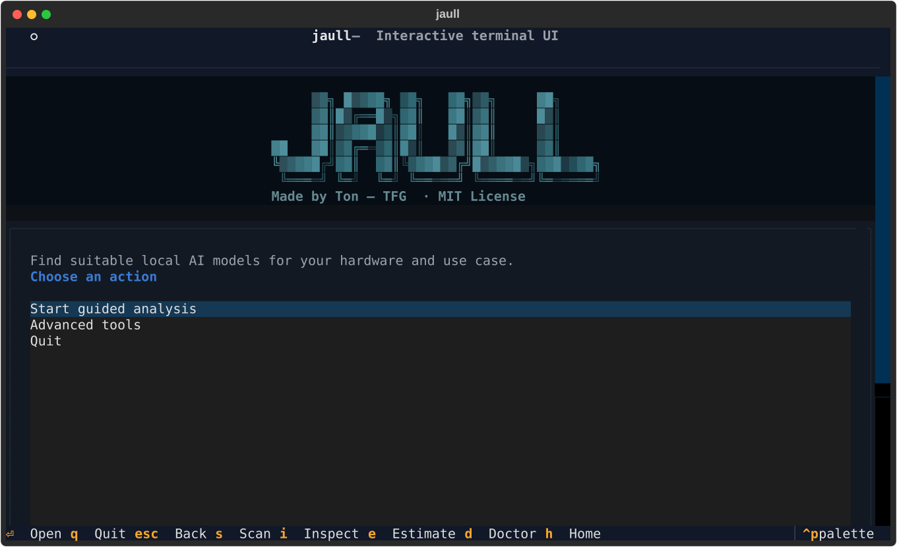

## Hardware analysis

Each checklist line turns green when its probe actually returns — there is no fake
progress — and the detected profile replaces the checklist **in place** when the scan
finishes, so the two states never look alike and nothing needs scrolling.

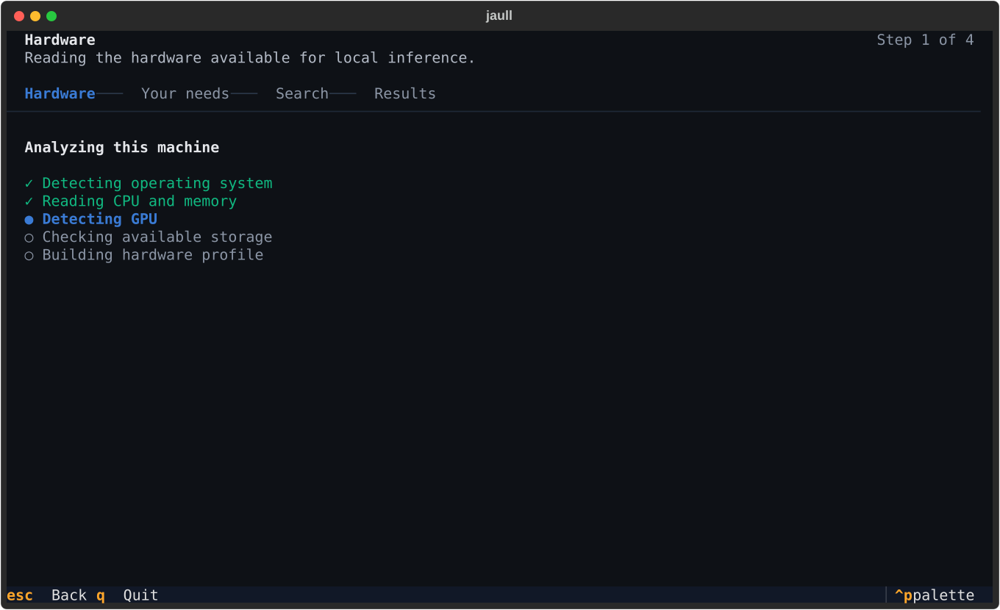

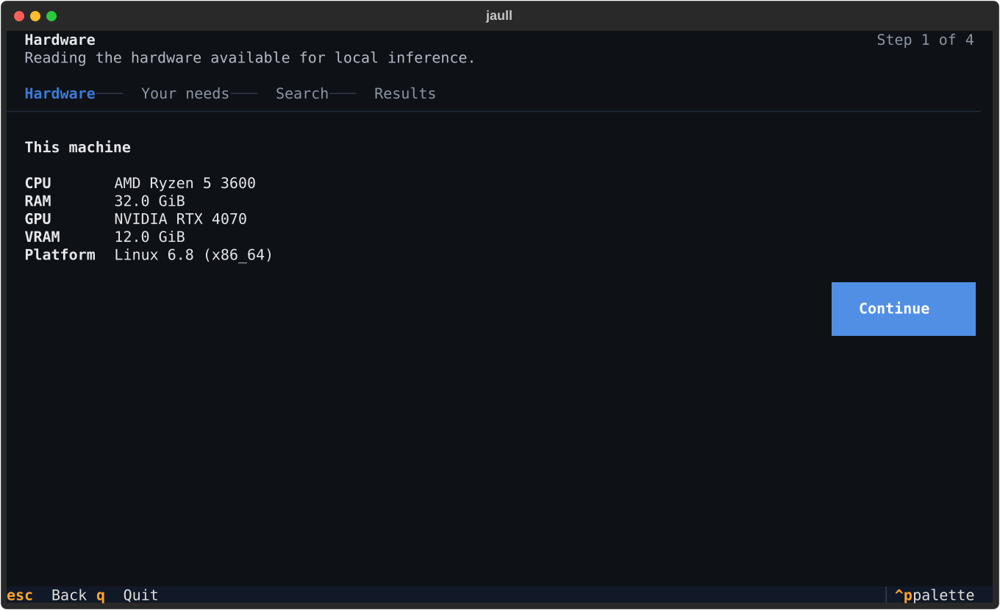

## Requirements wizard

Six plain-language questions — no model names, quantizations or dtypes.

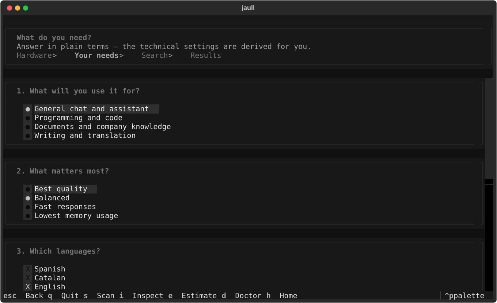

## Discovery

The search reports what it is really doing, and stays cancellable throughout.

This is the one step that genuinely takes minutes — a Hub search, then a metadata round-trip
and a header read per shortlisted repository — and the checklist only moves every twenty or
thirty seconds. The lane of water under it exists to fill that gap: a shark crosses it, the
water is empty for a beat, then only a fin comes back. It reports nothing, because between
checklist ticks nothing is known; it is there because a completely still screen is what a
stalled program looks like.

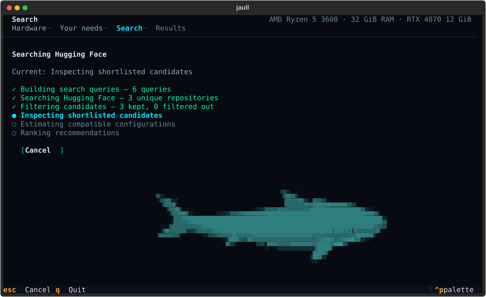

## Recommendations

The best match leads, with the alternatives compressed to one line each.

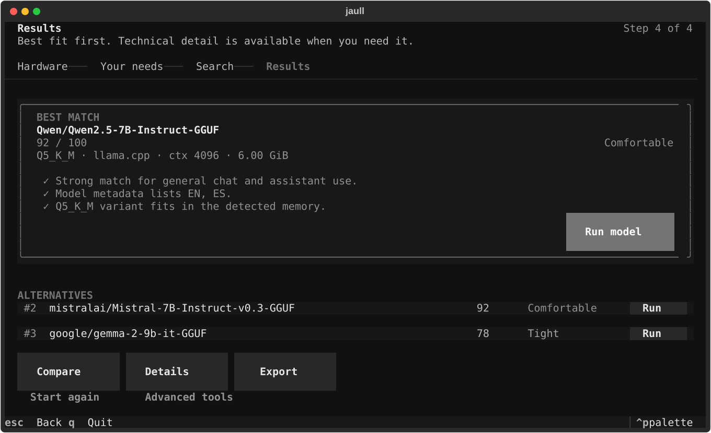

Any recommendation can be exported as a JSON + Markdown report.

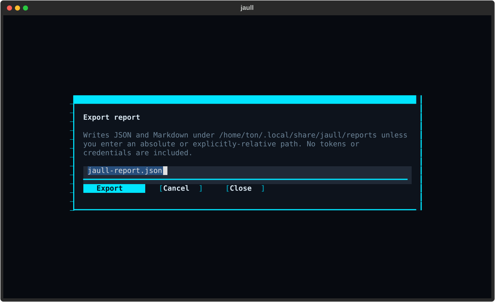

## Execution paths

The artifact variants and runtimes that could actually run the recommended model, each
labelled with the strongest evidence that exists for it.

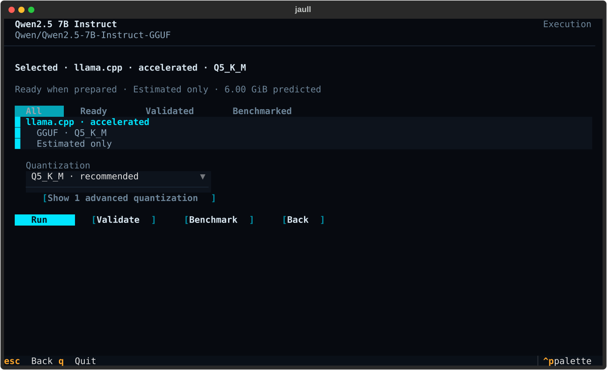

## Validation

Validation prepares the artifact, runs the plan for real and compares the prediction against
the observation.

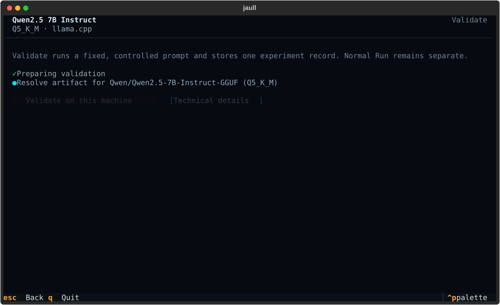

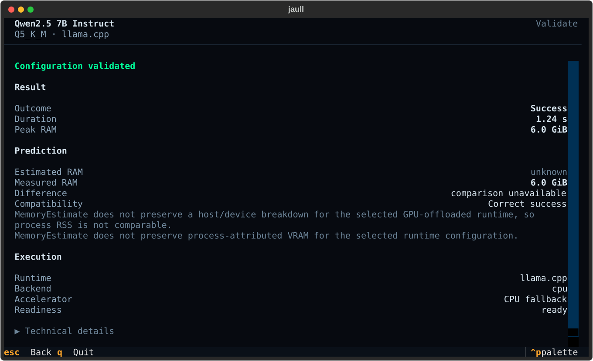

A failed run is still a result: the record is kept, and the failure reason is shown.

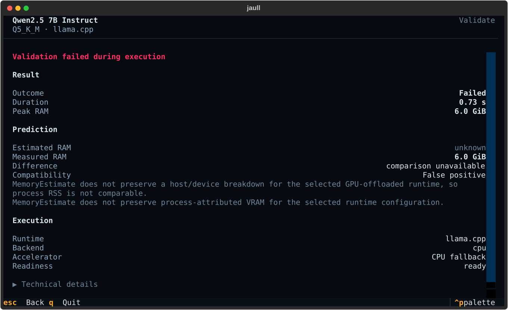

## Benchmarking

The same plan can be measured rather than estimated: `llama-bench` for llama.cpp, an isolated
Python worker for Transformers. The result is persisted as a `BenchmarkRecord` tied to a
fingerprint of this machine, so two plans are only ever compared when they were measured on
the same hardware.

When the runtime is not ready, the screen says why and what to install instead of invoking a
binary that is not there — the same sentence the Run and Validate screens use.

> No screenshot yet: `scripts/capture_screenshots.py` does not capture this screen.

## Running a model

A persistent composer over an append-only history. Each prompt is a single turn; the
artifact is prepared once and reused.

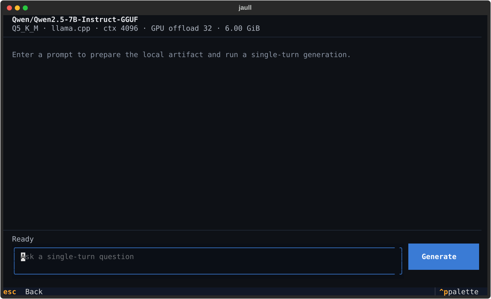

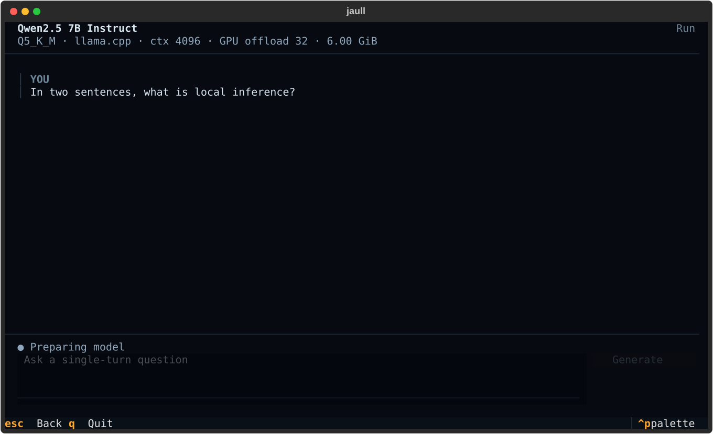

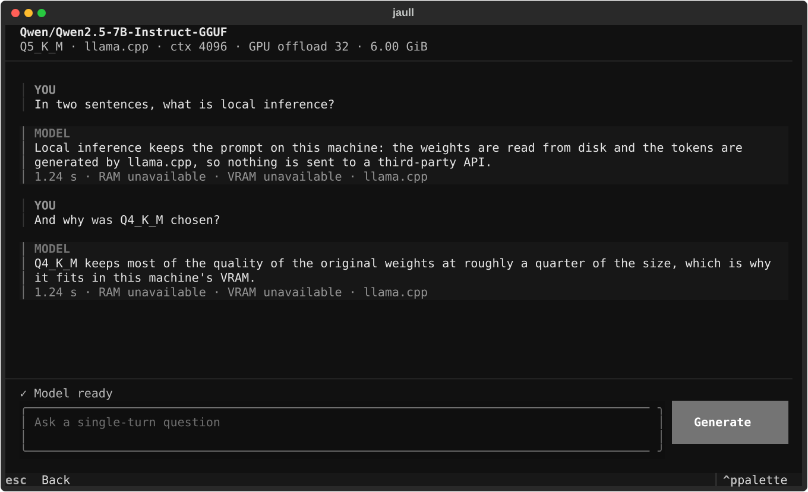

A failed run keeps the history and reports next to the composer, ready to retry.

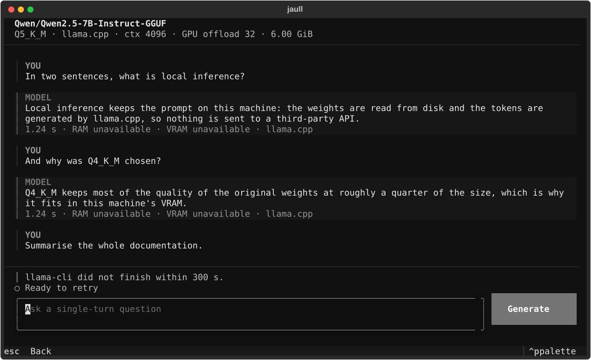

## Advanced tools

The individual tools keep their own screens, including the memory estimation view.

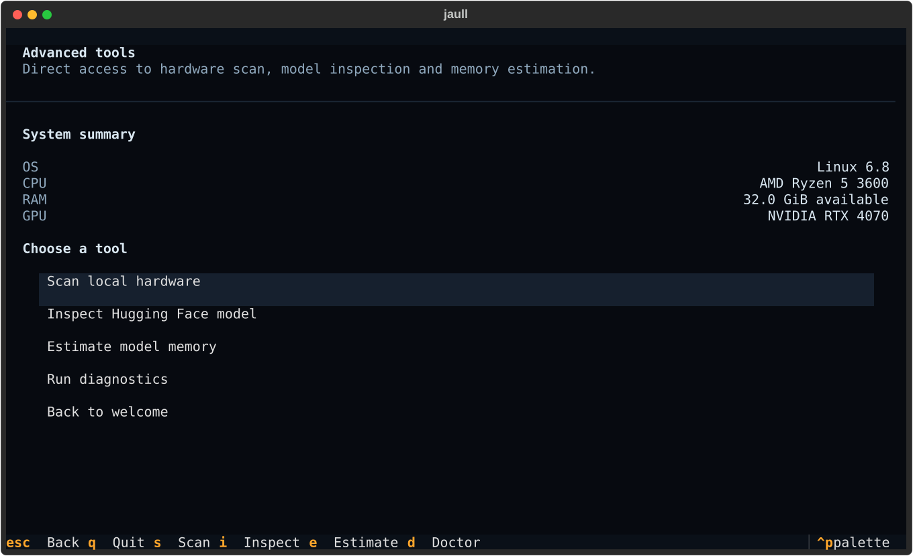

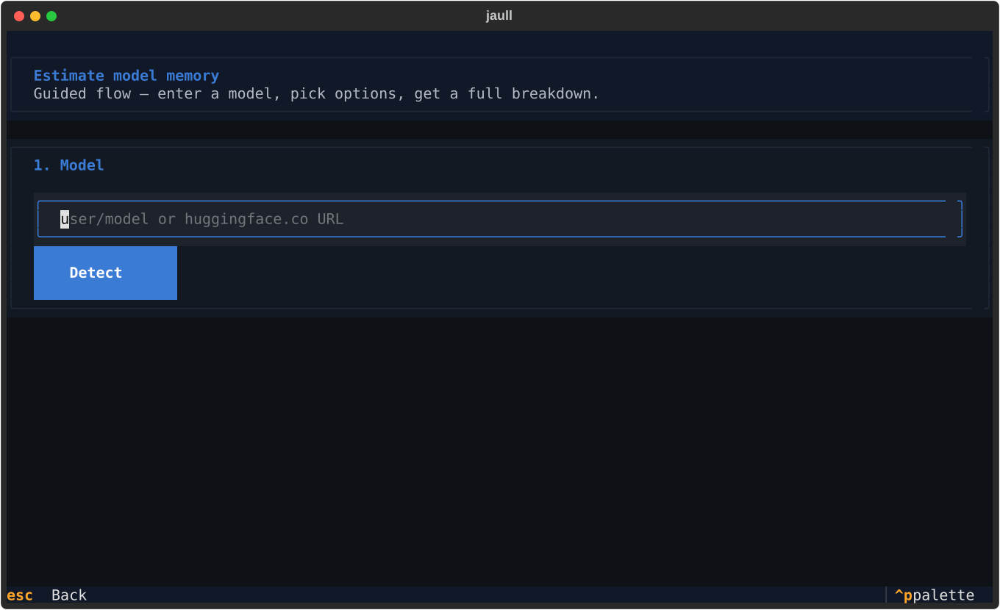
