# TUI screens

The full gallery. The README shows the main path; this page collects the remaining states,
including the ones that only appear while work is in flight or after a failure.

All screenshots are regenerated with:

```bash
uv run python scripts/capture_screenshots.py
```

That script is headless and touches no network and no `llama-cli`. Pass
`--size 90x28 --out <dir>` to review a narrower terminal without overwriting the committed
assets.

---

## Entry point

The TUI opens on a choice between a guided analysis and the individual tools.

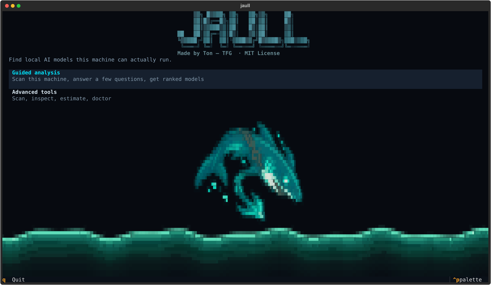

## Hardware analysis

Each checklist line turns green when its probe actually returns — there is no fake
progress — and the detected profile replaces the checklist **in place** when the scan
finishes, so the two states never look alike and nothing needs scrolling.

The profile leads with RAM and VRAM as large seven-segment figures, because every
claim Jaull makes afterwards is a claim about those two numbers.

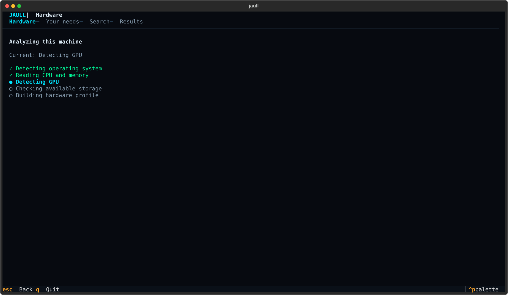

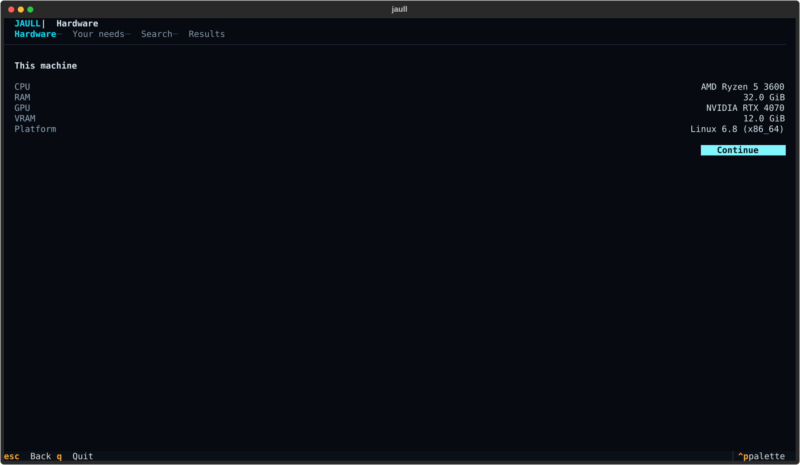

## Requirements wizard

Six plain-language questions — no model names, quantizations or dtypes. Each
carries a large question number, its own one-line label and a separate
explanation, laid out in two columns so the submit button stays on screen
without scrolling. Under 100 columns it folds to one.

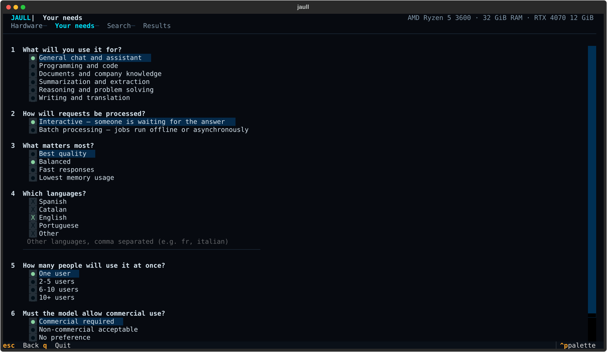

## Discovery

The search reports what it is really doing, and stays cancellable throughout.

This is the one step that genuinely takes minutes — a Hub search, then a metadata round-trip
and a header read per shortlisted repository — and the checklist only moves every twenty or
thirty seconds. The lane of water under it exists to fill that gap: a shark crosses it, the
water is empty for a beat, then only a fin comes back. It reports nothing, because between
checklist ticks nothing is known; it is there because a completely still screen is what a
stalled program looks like.

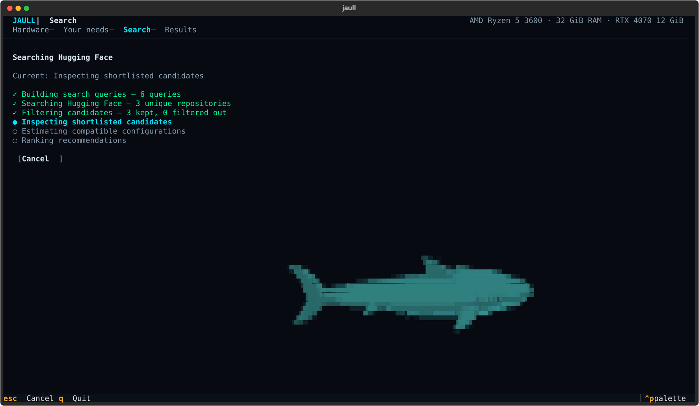

## Recommendations

The best match leads, with the alternatives compressed to one line each.

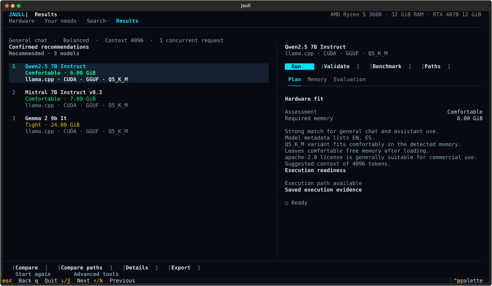

Any recommendation can be exported as a JSON + Markdown report.

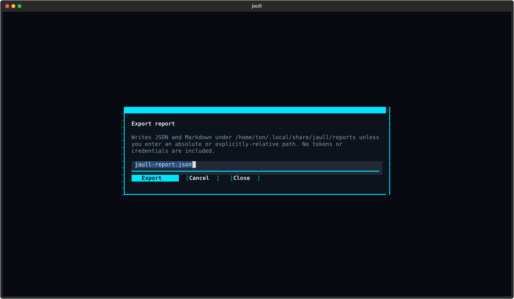

## Execution paths

The artifact variants and runtimes that could actually run the recommended model, each
labelled with the strongest evidence that exists for it.

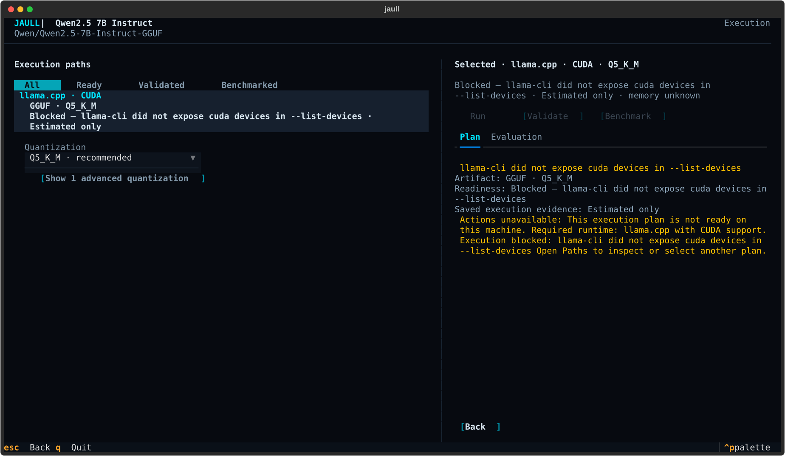

## Validation

Validation prepares the artifact, runs the plan for real and compares the prediction against
the observation.

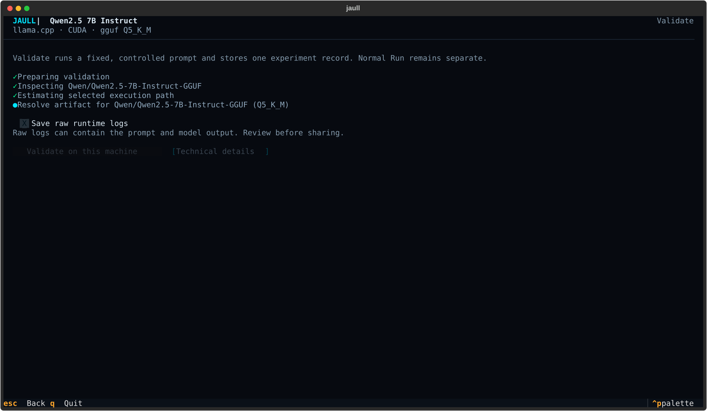

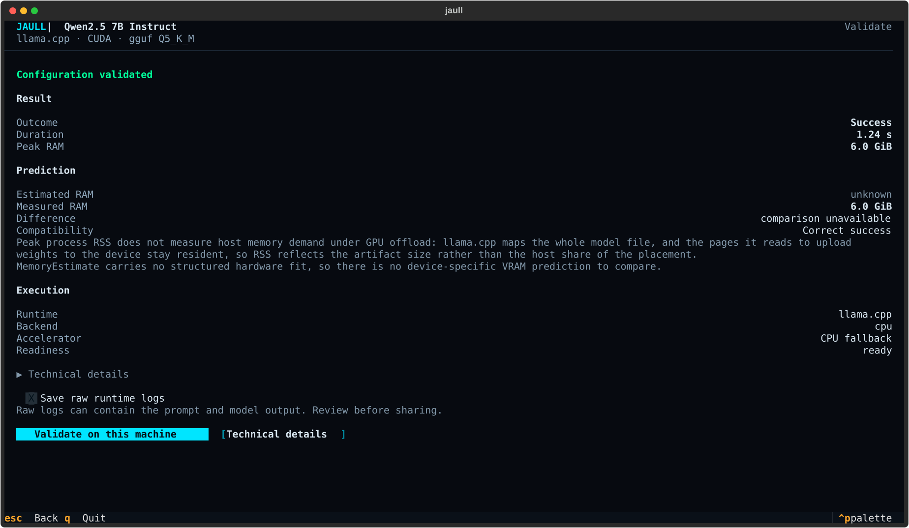

A failed run is still a result: the record is kept, and the failure reason is shown.

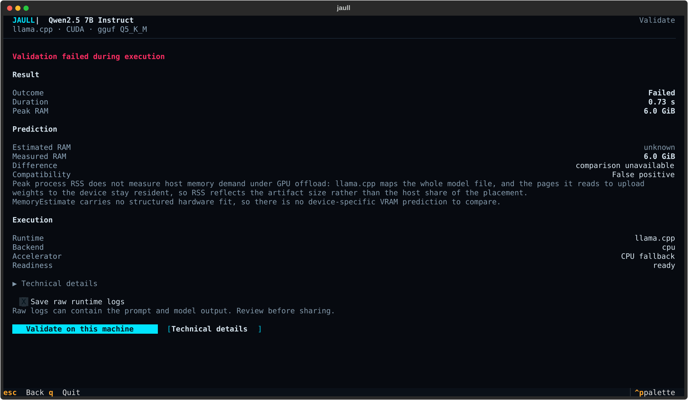

## Benchmarking

The same plan can be measured rather than estimated: `llama-bench` for llama.cpp, an isolated
Python worker for Transformers. The result is persisted as a `BenchmarkRecord` tied to a
fingerprint of this machine, so two plans are only ever compared when they were measured on
the same hardware.

When the runtime is not ready, the screen says why and what to install instead of invoking a
binary that is not there — the same sentence the Run and Validate screens use.

Benchmark, Validation and Doctor share one layout: the list of runs or checks on the
left, the detail of the selected one on the right. Below 120 columns the detail folds
under the list instead of opening a second screen, so there is one way to read a
result at any width.

> No screenshot yet: `scripts/capture_screenshots.py` does not capture this screen.

## Doctor

Every environment check on one side, the detail of the selected one on the other:
what was probed, what came back, and what to install when it did not. It reports
the same sentence the Run, Validate and Benchmark screens use, rather than each
screen inventing its own wording for a missing binary.

> No screenshot yet: `scripts/capture_screenshots.py` does not capture this screen.

## Quality evaluation

Opt-in, explicit, and never started by opening the screen. **Prepare evaluator**
checks the pinned server, image and dataset; **Start evaluation** runs the bounded
pilot on an exact GGUF. Model and dataset download consent are separate checkboxes
and both default to off. The protocol, its limits and the sample count stay visible
beside the result, and a completed run changes no recommendation order.

The quality workspace separates **Candidates** (or **Artifact**), **Settings**
and **Results** into tabs. Candidate rows distinguish local bytes from required
downloads; artifact paths and selection reasons remain expandable. Results show
aligned metrics, sample coverage and limitations, with provenance and the complete
run report one expansion away. The bottom actions stay visible at 80 columns.
Recompare lives in Results and returns a proposal without changing the search.
Its summary stays separate from per-plan diagnostics: each plan shows its
artifact and one primary blocker. Expanding that blocker reveals the complete
SHA256 and all evidence limitations. Changing suites clears both the proposal
and its diagnostics; measured results remain separate from ranking proposals.
The suite selector names the benchmark and sample count. Settings keeps the
dataset file and both download permissions outside the collapsed Advanced
section; server, Docker and output paths remain there. Missing advanced inputs
expand that section and receive focus when preparing or starting a run.

The Evaluation tab keeps **Published model references** and **Measured on this
artifact** in separate sections that never fill each other in. See
[the pilot](quality-evaluation-pilot.md) and
[capability evidence](model-capability-evidence.md).

> No screenshot yet: `scripts/capture_screenshots.py` does not capture this screen.

## Inspect

A single repository looked at directly, without going through a search: its
variants, metadata and the evidence that exists for each. Useful when you already
know the repo and the shortlist would not have reached it.

> No screenshot yet: `scripts/capture_screenshots.py` does not capture this screen.

## Running a model

A persistent composer over an append-only history. Each prompt is a single turn; the
artifact is prepared once and reused.

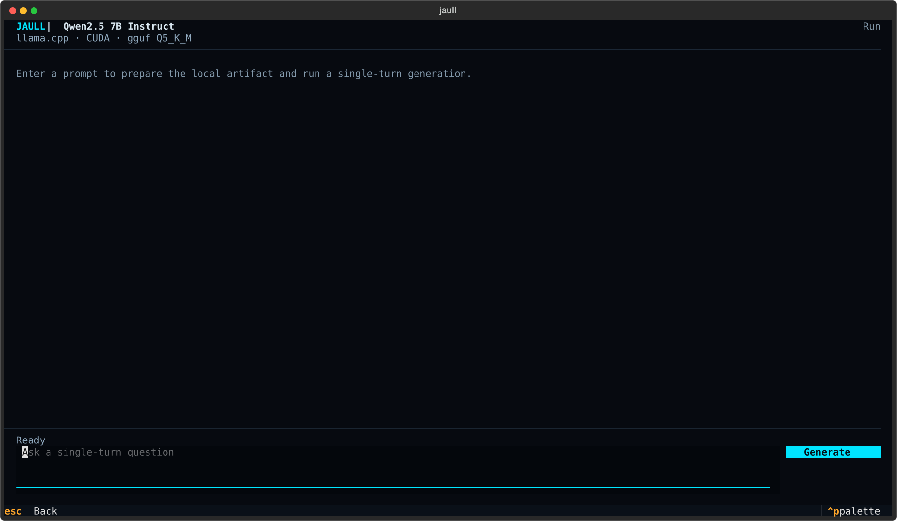

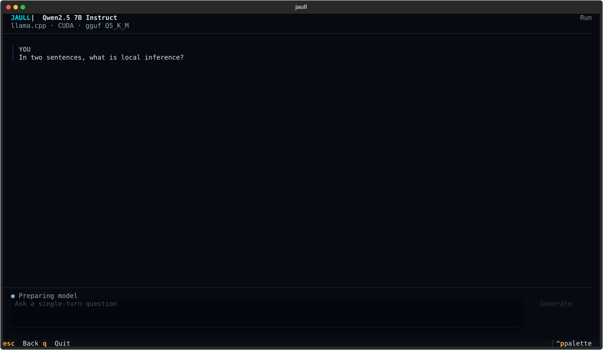

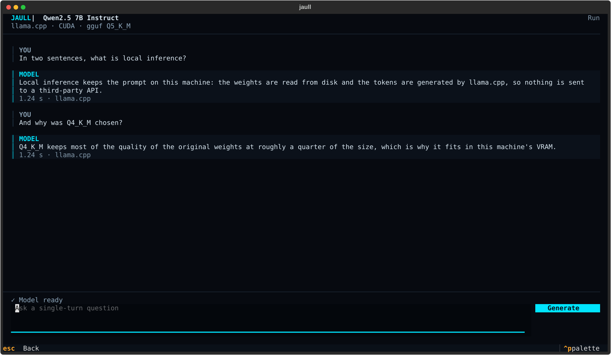

A failed run keeps the history and reports next to the composer, ready to retry.

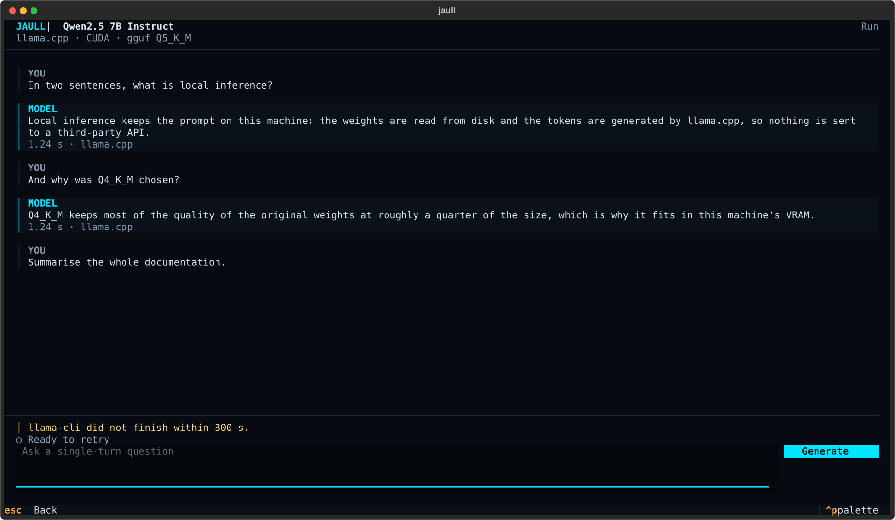

## Advanced tools

The individual tools keep their own screens, including the memory estimation view.

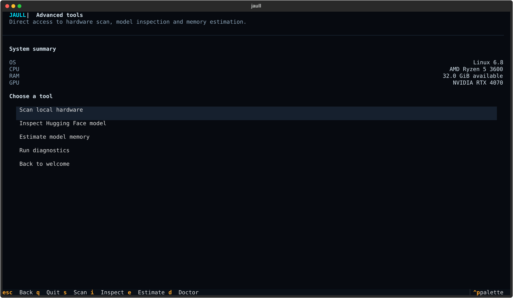

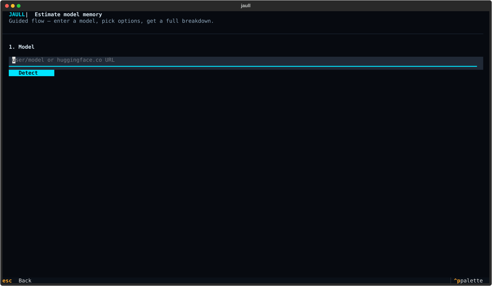
